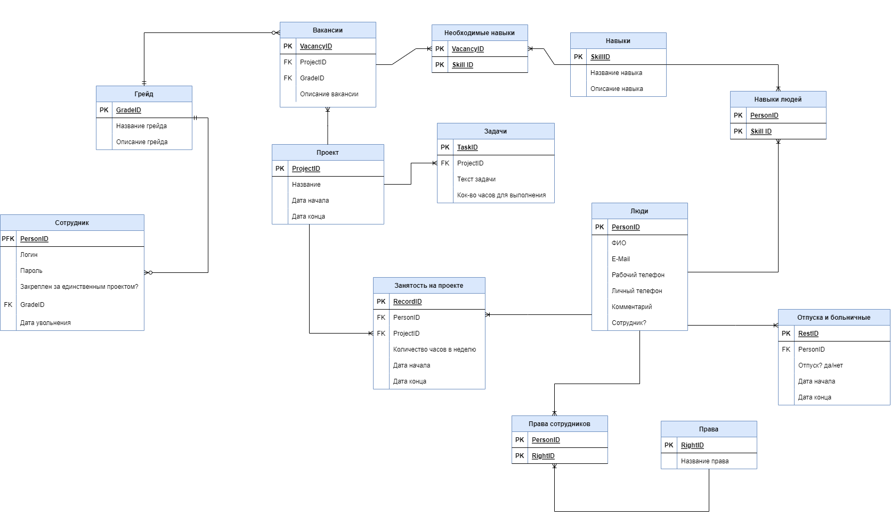

# Информационно-справочная система контроля проектов

### Команда:

- Крылова Елизавета
- Батманова Алиса
- Дибиров Мурат
- Марунько Анна
- Попов Илья
- Гришин Всеволод

## Требования
https://docs.google.com/document/d/16aePpq-26JNNOyGNtiiFJ3kxLvHgBjtaFiWm6wIsswI/edit

## Модель данных

## Используемых технологии

- Node.js
- Express
- PostgeSQL
